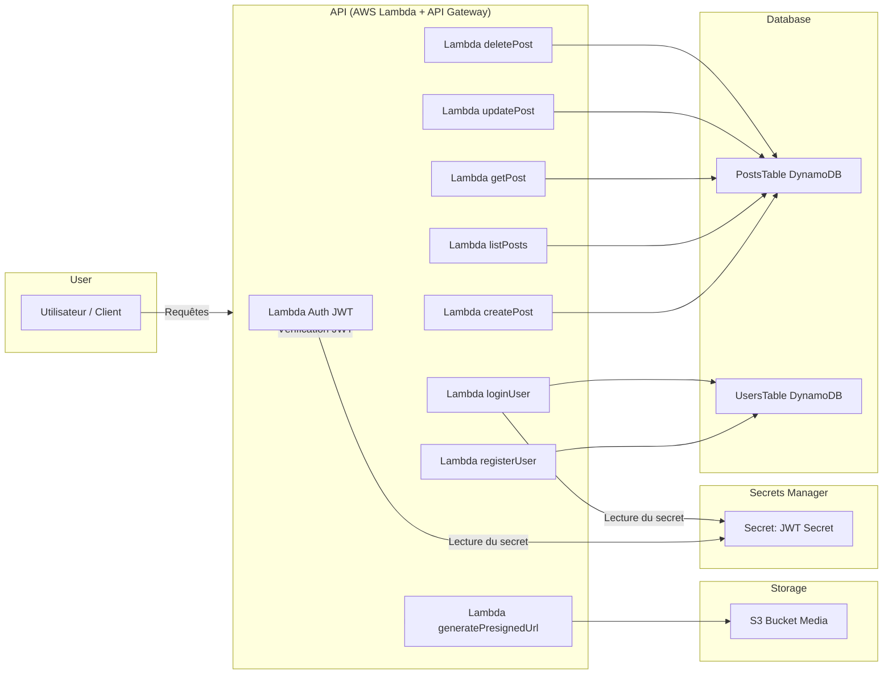

# Blogify

Blogify est une API de blog serverless basée sur AWS (Lambda, DynamoDB, S3, Cognito) permettant de gérer les posts, les utilisateurs et l’upload de médias.

---

## Table des matières

- [Installation](#installation)
- [Déploiement](#déploiement)
- [Architecture](#architecture)
- [API Endpoints](#api-endpoints)
- [Upload d’images](#upload-dimages)

---

## Installation

1. **Cloner le projet :**

```bash
git clone https://github.com/Miokido/5LAMB-blogify.git
cd blogify
```

2. **Installer les dépendances :**

```bash
npm install
```
3. **Installer Serverless Framework (si non installé) :**
```bash
npm install -g serverless
```

## Déploiement
1. **Configurer vos identifiants AWS :**

Pensez à bien créer un utilisateur IAM qui aura les droits pour faire ce déploiement.
Nous recommandons de créer un rôle "blogify-admin" qui aura l'unique autorisation "AdministratorAccess", suffisante pour nos opérations. Créez ensuite un utilisateur ayant ce rôle, et créez lui une clé d'accès pour CLI, en pensant à noter la clé d'accès ainsi que son secret.

```bash
aws configure
```
2. **Déployer le projet :**

```bash
serverless deploy
```
Vous pouvez utiliser les options --stage et --region pour modifier ces paramètres (par défaut ils sont à develop et eu-west-1)

3. **Variables d’environnement :**

Serverless se charge de créer automatiquement les tables DynamoDB, le bucket S3, les ressources Cognito et le secret JWT.

2. **Tester localement (optionnel) :**

```bash
serverless invoke local --function listPosts
```

## Architecture
Voici ci-dessous un diagramme résumant l'architecture du projet : 



## API Endpoints
Ci-dessous, un tableau regroupant les différents endpoints, associés chacun à une Lambda :

| Nom                  | Route            | Méthode | Auth | Description                                       |
|----------------------|------------------|---------|------|---------------------------------------------------|
| registerUser         | `/auth/register` | POST    | Non  | Inscription d’un nouvel utilisateur               |
| loginUser            | `/auth/login`    | POST    | Non  | Connexion utilisateur et récupération du JWT      |
| listPosts            | `/posts`         | GET     | Non  | Récupère la liste de tous les posts               |
| createPost           | `/posts`         | POST    | JWT  | Crée un nouveau post                              |
| getPost              | `/posts/{id}`    | GET     | Non  | Récupère un post par ID                           |
| updatePost           | `/posts/{id}`    | PUT     | JWT  | Met à jour un post                                |
| deletePost           | `/posts/{id}`    | DELETE  | JWT  | Supprime un post                                  |
| generatePresignedUrl | `/media/presign` | POST    | JWT  | Génère une URL pré-signée pour upload d’images    |

Toutes les routes ci-dessus, hormis register et login, nécessitent d'être authentifié.

## Description des rôles

Notre application contient 3 rôles : 
- Administrateur (admin) qui a les droits sur tous les posts peu importe leur status
- Éditeur (editor) qui peut créer des posts, voir tous les posts avec le statut "published" et voir ses propres posts "draft" ainsi que supprimer ses propres posts
- Invité (guest) qui ne peut pas créer de posts et uniquement voir les posts "published"

## Upload d’images

L’upload se fait en 2 étapes via S3 :

1. **Générer une URL pré-signée :**
- Requête POST sur /media/presign avec le nom du fichier et le type MIME.
- La Lambda generatePresignedUrl retourne :
  - url: URL pré-signée pour uploader directement sur S3
  - key: clé du fichier dans S3
```json
{
  "url": "https://bucket.s3.eu-west-1.amazonaws.com/...",
  "key": "uploads/filename.png"
}
```

2. **Uploader le fichier :**

- Faire un PUT HTTP directement vers l’URL pré-signée avec le fichier en body.
- Le fichier sera accessible via S3 avec la clé retournée.

Exemple avec curl :
```bash
curl -X PUT "<url>" \
-H "Content-Type: image/png" \
--data-binary "@image.png"
```

- Les permissions sont gérées via IAM et la politique attachée au rôle Lambda.
- Le bucket est configuré avec CORS pour autoriser les requêtes depuis le front-end si nécessaire.

3. **Créer le post :**
- Utiliser la requête /posts avec la méthode POST
- Passer l'élément "key" récupéré lors de la génération d'URL présignée dans le body

Exemple : 
```json
{
  "title": "Mon post avec image",
  "body": "Contenu du post",
  "status": "published",
  "media": [
    {
      "type": "image",
      "key": "uploads/xxx.png"
    }
  ]
}

```

## Supprimer les ressources associées

Pour supprimer les ressources associées au projet, utilisez la commande : 
```bash
serverless remove
```

Les paramètres --stage et --region sont toujours utilisables, toujours respectivement develop et eu-west-1 par défaut.

Il se peut que la destruction soit annulée si une des ressources n'est pas valide pour, notamment le S3 s'il n'est pas vide. Dans ce genre de cas suivre le message d'erreur et faire manuellement les opérations nécessaires.

## Tester l'API

Une collection Postman est mise à votre disposition pour tester l'API, voici les étapes à suivre :

- La collection contient les variables "baseUrl" et "jwtToken"
- baseUrl peut être récupéré lors du déploiement serverless, en suivant ce schéma : https://XXXXXXXX.execute-api.eu-north-1.amazonaws.com (bien penser à ne pas prendre le / final)
- jwtToken est récupéré lorsque la route "loginUser" est appelée
- En cas de changement de rôle de l'utilisateur, bien pensé à réexécuter la requête loginUser